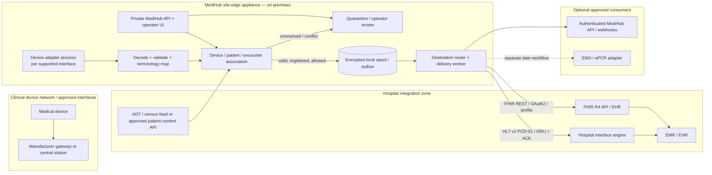
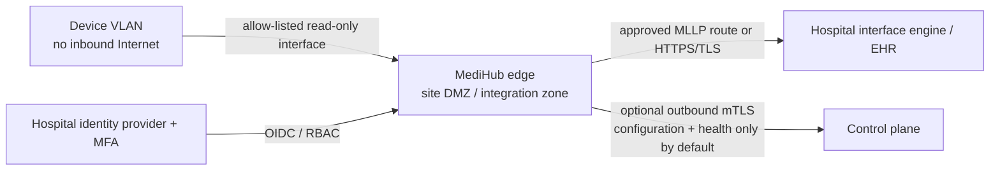

# MediHub Device Integration Bridge — Development Plan

**Document type:** product concept, technical architecture, and implementation plan\
**Prepared:** 2026-10-07\
**Status:** Research-based proposal; Bangladesh is a required deployment target; not a validated clinical system\
**Repository reviewed:** `deshiklab/MediHub` on the session branch

> **Terminology used in this plan.** I interpret “machine indication” as *medical-device integration*. “EMR” is treated as an electronic medical record / EHR destination. “EMS” can also mean **Emergency Medical Services**; that is covered as a separate, optional prehospital/ePCR connector in this plan. Confirm which meaning applies before committing to interfaces.

## 1. Executive summary

MediHub can be a **device-to-health-record integration gateway**: it connects to supported medical devices or their approved manufacturer gateways, translates their differing protocols and vocabularies into a versioned, device-neutral clinical event model, establishes the right patient/encounter context, durably queues the data, and routes it to authorized EMR/EHR or EMS systems.

It should **not** be designed as a magical universal cable/driver, a replacement EMR, or a system that directly controls devices. Medical-device connectivity is model-, firmware-, license-, and workflow-specific. A successful product therefore needs a maintained adapter for each supported device family (sometimes for each model/firmware), a deliberate patient-association process, and a tested destination integration. Where a manufacturer already provides an approved central station or gateway, integrate with that supported interface first rather than bypassing it.

### Required-market verdict: Bangladesh

Bangladesh is a required deployment country. The current answer is a **qualified yes for a bounded, read-only pilot—not yet a go for national-scale or “any device / any hospital” claims**. DGHS/MoHFW publishes a Bangladesh Core FHIR R4 implementation guide and a test sandbox, and official DGHS information describes the Shareable Health Record (SHR), Health ID, and Master Client Index (MCI)/HIE initiatives. Those are useful interoperability assets, but they do not prove that a named facility’s EHR has an authorized writable interface or that a production SHR endpoint will accept MediHub device observations. [19][20][21][22][23]

The main local adaptations are to use the facility-approved patient-context workflow (Health ID/UHID where available), minimize NID exposure, validate against a pinned Bangladesh Core version while confirming the actual receiver contract, and deploy an edge queue that survives site connectivity or power interruptions. BD-Core v0.4.6 is a Trial Use release; its profile pages are Informative/Maturity Level 1, and its device/vital-sign exchange coverage is incomplete. Bangladesh’s 2026 Personal Data Protection Act and DGDA medical-device framework also require local privacy and product-classification review before a live pilot. See §18 for the detailed conditions and gates.

### Recommended first release

Build an **edge-first, read-only, store-and-forward gateway** for one facility, one named device/interface, and one receiving system. Begin with a simulator and synthetic data; then use a manufacturer-authorized device interface in a lab. Support scalar observations and device status first. Do not initially support pump programming, device settings, clinical alarms/alert logic, diagnostic interpretation, or high-rate waveforms.

Use a Python modular monolith for the gateway and management API, with isolated device-adapter processes, PostgreSQL centrally, and a durable local spool at the site. Support both of these destination patterns behind a common routing layer:

1. **FHIR R4 REST API**, when the target EHR exposes an approved writable API and appropriate profile/authentication support.
2. **HL7 v2 ORU / IHE PCD-01 over MLLP**, usually through the hospital’s interface engine, when that is the supported hospital workflow.

Keep both protocol adapters as options, but choose **one first production interface** after checking the actual receiving system. FHIR is not automatically writable just because an EHR has a FHIR endpoint; v2 is not automatically accepted just because a hospital runs an interface engine.

### Product boundary

MediHub is an **integration and routing platform**. It should provide:

- Device connection/adapter management and device inventory.
- A canonical observation/event model with source and transformation provenance.
- Explicit patient/device/location association and conflict quarantine.
- Durable delivery, acknowledgement tracking, retries, de-duplication, replay, and audit.
- Destination connectors and a secure MediHub API for approved consumers.
- Operational status, queue visibility, configuration, and support diagnostics.

It should not copy an EHR’s entire chart, write directly to an EHR’s database, infer missing clinical facts, or claim interoperability with an untested device/EHR combination.

## 2. Repository and attachment review

The repository began as a minimal `README.md` starter with no source code or architecture documents. The README now links to this plan and records Bangladesh as a required deployment target. No user-provided attachments were present in the workspace at review time, so there were no device manuals, interface specifications, requirements, or diagrams to analyze. This plan is a greenfield proposal based on the request and the public references listed below; it can be refined when site/device artifacts become available.

## 3. How device-to-EMR integration works

A typical data path is a series of translations and safety checks—not one direct device-to-EMR API call:

1. **Acquire:** read through a documented device interface, such as a manufacturer gateway, standards-based interface, serial/USB/Ethernet interface, BLE service, file export, or existing HL7 feed.
2. **Decode:** parse the device’s frames/messages according to its documented protocol and device/firmware version. A device can have separate protocols for transport, messages, and clinical values.
3. **Normalize without losing meaning:** preserve the original source code/value/unit/time and map to agreed concepts and units. Store mapping version and quality flags. Do not guess unknown units, codes, states, or timestamps.
4. **Establish context:** resolve the device, site, location, patient, and encounter using approved sources (for example, device-reported identity, an ADT feed, or a verified operator action). If identity is ambiguous or sources conflict, hold the data for resolution instead of silently assigning it.
5. **Validate and persist:** apply structural, device-specific, semantic, and routing checks, then commit the event and its delivery intent to durable storage before acknowledging it or sending it downstream.
6. **Route:** create the receiving system’s required representation (FHIR resource, HL7 v2 message, or another agreed format) and transmit through its approved API/interface.
7. **Confirm and observe:** correlate acknowledgement/rejection with the event, retry transient failures, quarantine permanent failures, retain an audit trail, and show operators whether the source and route are healthy.

### What varies by device

| Source | Typical integration approach | Main caveat |
|---|---|---|
| Bedside monitor, ventilator, anesthesia machine, infusion pump | Manufacturer-supported gateway/API, IEEE 11073/SDC where implemented, or a licensed/documented vendor protocol adapter | Acute-care devices often expose data through a vendor central station; the individual machine may not expose a supported public API. A device adapter is model/firmware-specific. |
| Point-of-care meter or personal health device | Manufacturer API or a supported Bluetooth/USB profile; IEEE 11073 personal-health-device mapping when applicable | Pairing, clock quality, user identity, and the distinction between consumer and professional-use device models matter. |
| Existing device-to-enterprise feed | Consume the approved HL7 v2/IHE feed from the vendor gateway or interface engine | Validate the sending application, codes, OBX semantics, patient context, ACK behavior, and local implementation guide. |
| Imaging modality | Separate DICOM/DICOMweb/PACS integration | Imaging objects and waveforms are not just scalar vital signs; use imaging workflows and conformance statements. DICOM is an imaging information exchange standard. |
| EMS field device / ePCR workflow | Separate EMS/ePCR connector, typically with jurisdiction- and vendor-specific formats; NEMSIS is relevant in the U.S. | EMS incident/run context is not identical to a hospital encounter. State/local requirements and vendor interfaces vary. |

**Standards map:** IEEE 11073 helps model device structure and device semantics; IHE Patient Care Device profiles specify enterprise workflows and exchanges; HL7 v2 is a widely used hospital messaging option; FHIR provides resource models and REST APIs; LOINC, UCUM, and IEEE MDC support clinical/device terminology. These layers complement rather than replace one another. IHE DEV DEC describes communicating patient-care-device data with the PCD-01 transaction, and the HL7 Point-of-Care Device (PoCD) FHIR guide models device observations/resources. The current PoCD continuous build is marked trial-use/ballot content and explicitly says it supplements rather than replaces established PCD-01 workflows; pin a published guide version and verify the receiving system’s profile before relying on it. [4][9][10][13]

### Important limitation: one adapter per interface, not one adapter for all machines

MediHub’s extensibility should come from a stable adapter contract, not from promising that all devices speak the same protocol. Prefer, in order:

1. Manufacturer-provided, supported gateway/API or interface specification.
2. A standards-based interface explicitly supported by that device and receiving site.
3. A device-specific adapter implemented under written authorization and tested against documented protocol behavior.
4. A bounded file/export interface if real-time streaming is not required.

Do not make reverse-engineering undocumented or access-controlled protocols, bypassing device security, or attaching an unapproved device to a clinical network part of the product plan. Confirm vendor permission, licensing, facility approval, device conformance documentation, and local cybersecurity/safety review first.

## 4. Public GitHub research and design lessons

The public code review is an architecture reference, not evidence that any repository is a certified or production-ready clinical product.

| Public project | What it demonstrates | How MediHub should use the lesson / limitation |
|---|---|---|
| [OpenBedside](https://github.com/danielpettus/openbedside) and its [architecture](https://github.com/danielpettus/openbedside/blob/main/docs/ARCHITECTURE.md), [HL7 interface](https://github.com/danielpettus/openbedside/blob/main/docs/HL7-INTERFACE.md), and [vendor adapter guide](https://github.com/danielpettus/openbedside/blob/main/docs/VENDOR-INTEGRATION-GUIDE.md) | A closely related Python gateway design: vendor protocols stop at the adapter; adapters publish a shared device model; patient association is explicit; an outbox stores before send; outbound PCD-01/ORU uses application ACKs; ADT feeds can maintain a location census. | This is a particularly useful architectural reference for MediHub’s first iteration. It is an early project (the reviewed repository describes version 0.2), and its worked pump protocol is fictional/simulated; its documentation says order delivery is simulator-only and lists security work not yet completed. Use the design ideas and tests, not its status as proof of real-device interoperability or clinical readiness. Independently review license and dependency terms before copying any code. |
| [MD PnP OpenICE](https://github.com/mdpnp/mdpnp) and [supported-device list](https://github.com/mdpnp/mdpnp/blob/master/devs.md) | A longstanding open-source research platform with device drivers/adapters, device information models and nomenclature work, real-time middleware (DDS), and demonstrations across device types. | Study the adapter boundaries, device hierarchy, and test/simulation patterns. It is primarily Java/DDS, so MediHub can use it as a protocol/domain reference without rewriting its platform in Java. Verify individual driver support, licensing, hardware availability, and current maintenance before depending on it. |
| [HL7 Point-of-Care Device FHIR IG source](https://github.com/HL7/uv-pocd) and [current build](https://build.fhir.org/ig/HL7/uv-pocd/) | Defines FHIR representations for acute-care point-of-care device observations and rich device metadata, based on IEEE 11073 concepts. | Use it as the semantic mapping guide where applicable, but do not mistake an evolving trial-use guide for a device transport protocol or universal EHR contract. Pin its published version, profile against the target, and keep PCD-01 available for sites that require v2. |
| [OpenEMR](https://github.com/openemr/openemr), especially its [FHIR API documentation](https://github.com/openemr/openemr/blob/master/Documentation/api/FHIR_API.md) | A real open-source EHR codebase and a practical candidate for an integration test environment. Its current documentation describes FHIR R4 resources, authentication/scopes, and API capabilities. | Use a local/sandbox OpenEMR deployment for synthetic end-to-end tests. Treat its capability statement, version, auth setup, and supported write behavior as specific to that installation; do not generalize its API coverage to commercial EHRs. |
| [HL7apy](https://github.com/crs4/hl7apy) and [python-hl7](https://github.com/johnpaulett/python-hl7) | Python tools for HL7 v2 message parsing/building; HL7apy documents message parsing, creation, validation, and MLLP-related support. | Evaluate one parser against the exact site message profiles, delimiter variations, repetitions, escapes, character sets, and ACK modes. A parser library does not replace interface-specific conformance tests or durable delivery logic. |
| [fhir.resources](https://github.com/nazrulworld/fhir.resources) | Python FHIR resource models/serialization built around Python data models. | Useful for building and inspecting FHIR JSON in Python. Pair it with the HL7 FHIR Validator and the target implementation guide; model validation alone is not profile, terminology, server capability, or workflow conformance. |
| [HL7-maintained FHIR validator source](https://github.com/hapifhir/org.hl7.fhir.core) | The HL7 FHIR project distributes a Java-based validator library/CLI for FHIR resources and implementation-guide profiles. | It is reasonable to keep the application and mapping code in Python while invoking the pinned validator in CI/integration tests. Pin the JAR and IG packages; do not silently validate against a moving “latest” build in a release pipeline. |

### Research conclusions applied to this plan

- **Adapter → canonical model → routing** is the core product boundary. This makes vendor-specific code replaceable and keeps each destination connector independent.
- **Patient association and delivery reliability are core features**, not “later admin enhancements.” A correct reading attached to the wrong patient is still a serious integration failure.
- **Use both legacy and modern hospital faces.** IHE PCD-01/HL7 v2 is relevant for acute-care device reporting; FHIR is increasingly useful for API-based exchange, but actual target support must be discovered and tested.
- **Start with synthetic simulation, then one real device and one receiving system.** Open-source simulators and test servers are useful, but they do not prove a real device, network, clinical workflow, or EHR contract.

## 5. Product scope and release boundaries

### MVP — “one supported feed, one destination, safely delivered”

Include:

- Site, location, device, model, adapter, and firmware registration.
- One simulator and one selected, authorized device interface.
- Read-only acquisition of selected scalar measurements and device connectivity/status.
- A versioned canonical event schema with original source value/code/unit/time retained.
- Device/patient/location/encounter association, including explicit “unknown” and “conflict” states.
- Durable local store-and-forward and destination-specific outbox/status.
- One outbound connector chosen for the pilot (FHIR R4 **or** HL7 v2 through the hospital interface engine).
- A private, documented MediHub API, basic operator/admin UI, audit events, health checks, metrics, and replay controls.
- Synthetic data, conformance tests, deployment runbook, and a supported-device matrix.

### Explicitly out of scope for MVP

- Device commands, therapy changes, order programming, pump programming, or feedback/closed-loop control.
- MediHub-generated clinical alarms, alerts, triage, diagnosis, or treatment recommendations.
- Unreviewed clinical interpretation or data “correction” (for example, guessing the patient, unit, or device state).
- High-frequency ECG/EEG/waveform streaming and image ingestion as if they were ordinary scalar readings.
- General-purpose “supports every brand” claims.
- Production use with real patient information before institutional approval, security/privacy review, target-system testing, and regulatory assessment.

### Later releases

1. Add additional device adapters only after the first adapter has stable contract tests and a supported firmware matrix.
2. Add the alternate EHR connector (FHIR or HL7 v2), then additional routes/fan-out with independent delivery state.
3. Add EMS/ePCR mapping as a separate domain connector if required. In the U.S., check the applicable NEMSIS version, state data set, and ePCR vendor contract; the NEMSIS site currently publishes v3.5.1 data dictionaries, schemas, and APIs. [18]
4. Consider waveform, imaging, alarms, and control only as separate scope and safety/regulatory programs—not as routine adapter additions.

## 6. Recommended system architecture

### High-level view



### Deployment and trust zones



- Prefer an on-premises VM or industrial Linux appliance in a hospital-approved integration/DMZ zone. Device traffic should remain local; use narrowly allow-listed routes to devices or manufacturer gateways.
- Do not open a public inbound port into the device VLAN. For an optional managed control plane, initiate an outbound, authenticated connection from the edge. Keep patient data at the site unless the customer has approved a hosted service, data-processing terms, data residency, and required business associate arrangements.
- Make interfaces read-only for MVP. Network controls should prevent MediHub from reaching device control/configuration ports unless separately approved for a later regulated feature.
- For legacy MLLP, use a hospital-approved private network/VPN or TLS-protecting tunnel/gateway and strict ACLs. MLLP framing itself is not an authentication or encryption mechanism.

### Software boundaries

1. **Device adapters:** transport connection, protocol parsing, device identity, raw-to-device-model decoding, device-specific time/quality/state handling. An adapter publishes only the internal contract; it must not post directly to an EHR.
2. **Ingestion/domain service:** validate schema, preserve original information, normalize only approved mappings, deduplicate, attach source/provenance, persist event and outbox atomically.
3. **Context service:** registry, patient/encounter/location associations, ADT/FHIR context updates, conflict rules, human review, and association history.
4. **Routing service:** policy evaluation and one delivery record per destination. A failure in one destination must not silently erase or block delivery state for other destinations.
5. **EHR/EMS adapters:** translate canonical events into the exact destination contract, authenticate, send, parse acknowledgements/errors, apply destination rate limits, and report outcomes.
6. **Management API/UI:** device and destination setup, health, quarantine resolution, mapping review, delivery history, replay, audit. Restrict replay and patient reassignment to authorized roles.
7. **Observability:** health and performance metrics, traces, structured logs with PHI redaction, and a security/audit trail.

Start as a **modular monolith plus separately supervised adapter/worker processes**, not a fleet of microservices. Split services only when deployment boundaries, performance, or independent release needs justify the operational cost.

## 7. Canonical event and clinical semantics

### Minimum event envelope

A normalized reading/event should carry at least:

```json
{
  "schema_version": "1.0",
  "event_id": "a-stable-uuid-or-source-derived-id",
  "site_id": "site-001",
  "observed_at": "2026-10-06T12:00:00Z",
  "received_at": "2026-10-06T12:00:01Z",
  "time_quality": "device-synchronized",
  "device": {
    "device_id": "registered-device-001",
    "manufacturer": "Example Manufacturer",
    "model": "Example Model",
    "serial_or_udi_ref": "vaulted-or-access-controlled-reference",
    "adapter_id": "example.adapter",
    "adapter_version": "0.1.0",
    "firmware_version": "recorded-if-available"
  },
  "context": {
    "patient_identifier": {
      "system": "https://hospital.example/identifier/mrn",
      "value": "SYNTHETIC-0001"
    },
    "encounter_ref": "optional-target-specific-reference",
    "location_ref": "ward/room/bed",
    "association_status": "confirmed",
    "association_source": "adt-location-plus-operator-confirmation"
  },
  "metric": {
    "source_code_system": "source-code-system-uri",
    "source_code": "device-code",
    "mapped_code_system": "http://loinc.org",
    "mapped_code": "only-when-reviewed-and-approved",
    "mapping_version": "terminology-map-2026-01"
  },
  "value": {
    "kind": "quantity",
    "value": 98.0,
    "source_unit": "%",
    "ucum_unit": "%"
  },
  "quality": {
    "status": "valid",
    "flags": []
  },
  "provenance": {
    "source_message_id": "source-sequence-or-message-id",
    "source_payload_hash": "optional-hash-not-a-payload-log",
    "transform_id": "normalizer-1.0"
  }
}
```

This is an example contract, not a final schema. `patient_identifier` is sensitive health information: synthetic examples only; production identifiers must be access-controlled, encrypted as appropriate, and excluded from ordinary logs/metrics. Do not store patient names in the adapter unless a documented workflow requires them. Keep the source device’s identity distinct from the MediHub gateway identity.

### Data rules

- Record both **device event time** and **gateway receive time**. Preserve the original timezone/offset and a clock-quality indicator; never quietly replace an invalid device clock with server time and present it as measurement time.
- Preserve the device’s source code, raw value, source unit, source status, and measurement context. Add normalized LOINC/UCUM/IEEE MDC codings only through reviewed, versioned mappings. A code conversion is not permission to discard the original meaning.
- Unknown code/unit/state, missing required context, implausible wire format, invalid value type, or unsupported firmware should produce a visible validation outcome and, where necessary, quarantine—not a guessed value or silent drop.
- Keep a mapping catalog with source code/unit, target code/unit, map version, justification/source, reviewer, effective date, and test fixtures. Any terminology change should be reviewable and replayable.
- Retain source-message/payload data only when needed and approved for troubleshooting; use short retention, access controls, encryption, and PHI-safe redaction. A payload hash can help correlate evidence without placing full frames in logs.
- Track whether an observation was directly reported by the device or inferred by MediHub. Inferences should be excluded from MVP; if later added, label them explicitly and do not present them as device-reported facts.

### FHIR representation

For an applicable R4 interface, common resources include `Device`, `Observation`, `Patient`, `Encounter`, and, where useful and supported, `DeviceMetric` and `Provenance`. FHIR R4 `Observation` supports a measurement code, patient/subject, encounter, effective time, value or components, units, interpretation/status, and a reference to the measurement device. [10]

Illustrative blood-pressure resource (synthetic; **not** a complete profile-conformance example):

```json
{
  "resourceType": "Observation",
  "identifier": [{
    "system": "https://medihub.example/observation-id",
    "value": "site-001-device-001-event-000123"
  }],
  "status": "preliminary",
  "category": [{
    "coding": [{
      "system": "http://terminology.hl7.org/CodeSystem/observation-category",
      "code": "vital-signs"
    }]
  }],
  "code": {
    "coding": [{
      "system": "http://loinc.org",
      "code": "85354-9",
      "display": "Blood pressure panel"
    }]
  },
  "subject": { "reference": "Patient/{target-patient-id}" },
  "encounter": { "reference": "Encounter/{target-encounter-id}" },
  "effectiveDateTime": "2026-10-06T12:00:00Z",
  "device": { "reference": "Device/{target-device-id}" },
  "component": [
    {
      "code": { "coding": [{ "system": "http://loinc.org", "code": "8480-6" }] },
      "valueQuantity": { "value": 120, "unit": "mmHg", "system": "http://unitsofmeasure.org", "code": "mm[Hg]" }
    },
    {
      "code": { "coding": [{ "system": "http://loinc.org", "code": "8462-4" }] },
      "valueQuantity": { "value": 80, "unit": "mmHg", "system": "http://unitsofmeasure.org", "code": "mm[Hg]" }
    }
  ]
}
```

The status (`preliminary`, `final`, `amended`, etc.), code profile, device reference, and review workflow must match the target’s profile and clinical policy. In particular, **do not automatically mark every device value `final`** without agreeing how the source, review, and charting workflows work. The PoCD guide can require IEEE MDC codings alongside relevant LOINC/UCUM codings; validate against the pinned guide and the EHR’s actual implementation guide. [4][13]

For a Bangladesh destination, the generic resource example above is not a claim of BD-Core conformance. The v0.4.6 BD Observation base is abstract; its published derived Observation profiles are for laboratory panels/results, while a dedicated vital-signs profile is listed as planned work. Do not map bedside vitals to a laboratory-result profile by analogy. Pin the profile required by the receiving site and agree any device-observation profile, terminology, and transaction rules with that site/DGHS before implementation. [20]

For stable delivery, assign each event a stable identifier and use the target server’s supported conditional-create/transaction behavior where available. Maintain MediHub’s own delivery ledger as well: not every EHR supports the same conditional operations, update semantics, or write scopes. Never assume that a successful HTTP `200`/`201` means the desired clinical workflow occurred; inspect the response, resource identity, and any `OperationOutcome`.

## 8. Patient identity, ADT, and safe association

This is one of the highest-risk parts of the product.

### Sources of context

- **Device-reported patient ID** or a validated bedside patient/ID scan, when the device and workflow support it.
- **Inbound ADT** events for the patient’s active admission, visit, and location (with facility-specific event coverage and identifier authorities).
- **Approved EHR/FHIR queries** for a known enterprise identifier and current encounter/location.
- **Explicit operator association** with authenticated user, reason, timestamp, and audit record.

### Association policy

1. Register the device using a stable, facility-recognized ID (UDI/serial/asset identifier). Do not treat an IP address as device identity.
2. Keep association validity time-bounded (`valid_from`, `valid_to`) and preserve history. A patient/location change should not silently rewrite previously delivered observations.
3. Use only configured authoritative sources. If more than one source is available and they conflict, mark the association as `conflict` and withhold outbound delivery until resolved.
4. Bed/location matching is allowed only when the facility has approved that workflow and the bed maps to exactly one active patient at the event time. A device may move with a patient while the bed receives a new patient; location alone is not always enough.
5. Unknown patient is a first-class state. Do not fabricate a patient, use the last known patient indefinitely, or search broad patient lists using names/DOB to make a guess.
6. On discharge, merge, transfer, encounter closure, device disconnect, or manual override, update the association state and create an auditable event. Handle late/out-of-order ADT updates and patient identifier merges explicitly.
7. Route only observations with a valid patient context if the receiving system requires it. If the target supports an approved unidentified-patient workflow, implement it as a separate, tested policy.

For hospital feeds, an inbound ADT adapter may be needed even when outbound device data is FHIR: patient admission/transfer/discharge context often arrives from an HL7 v2 interface engine. OpenBedside’s public design also treats ADT census and patient association as an explicit service rather than a field copied blindly into a message. [1]

For a Bangladesh site, use its approved registration/MCI workflow and the facility’s authoritative identifier mapping; use a Health ID/UHID only when that site can lawfully supply and verify it. Do not use NID as a MediHub-wide key, match patients by name, or create national Patient records from device traffic. If the receiver requires a BD Patient resource, its current profile requires a UHID identifier and defines optional NID/BRN identifiers, English/Bangla name extensions, and a father-or-mother RelatedPerson constraint; obtain required data from the authorized source and minimize what MediHub stores. [20][22]

## 9. Integration contracts

### A. FHIR R4 destination adapter

1. Discover and record the destination FHIR base URL, `CapabilityStatement` (`GET /metadata`), FHIR version, supported resources/search parameters/operations, implementation guides, rate limits, and write behavior.
2. Discover SMART/OAuth metadata (where offered), register an integration client with the target, and document its exact authorized scopes. For an unattended backend, prefer the target’s supported SMART Backend Services flow with short-lived access tokens and asymmetric client authentication/private key JWT where supported. Keep the private key in an approved secret/key store, rotate it, and limit access to the specific device-observation workflow. [11]
3. Read/resolve patient and encounter context through a facility-approved method. Do not query a full patient population for each event.
4. Create the destination `Device`/`Observation` resources or bundle according to the target’s profiles and references. Use stable identifiers, correct timestamps, codings, UCUM units, provenance, and status.
5. Handle pagination, throttling (`429`), transient server errors, OAuth expiry, FHIR `OperationOutcome`, reference errors, duplicate/conditional-create responses, and permanent validation failures.
6. Validate resources locally against the pinned FHIR release and implementation-guide packages using Python resource models plus the HL7 FHIR Validator CLI in CI/integration tests. [8][12]

### B. HL7 v2 / IHE PCD destination adapter

1. Work with the site’s interface analyst to select the exact HL7 version, IHE profile, trigger event, segment usage, code systems, receiving application/facility, ACK mode, character set, and network route.
2. Prefer **PCD-01 `ORU^R01`** for device observation exchange when the receiving interface supports it; generic `ORU^R01` is not automatically the same as a site’s PCD-01 contract. The IHE DEV framework describes PCD-01 as a device observation reporter-to-consumer exchange. [9]
3. Implement MLLP framing, message control IDs, ACK/NAK parsing and correlation, timeouts, reconnection, ordering, retry, de-duplication, and durable store-before-send. HL7apy is one Python library candidate, not a replacement for facility testing. [6]
4. Persist each outbound message and its destination state until the expected acknowledgement is received. Distinguish a transport write from an application acceptance. Do not mark a message delivered merely because the TCP socket accepted bytes.
5. Ensure retransmissions are safe at the receiving side or are deduplicated by the interface engine; test what happens after disconnects, duplicate messages, partial frames, AE/AR, and a missing ACK.
6. Receive only agreed inbound message types (for example, selected ADT events), validate them, and promptly acknowledge according to the site’s agreed ACK behavior. A positive ACK should not be returned until the message has been safely accepted/persisted according to the interface contract.

### C. MediHub API for other consumers

MediHub should expose an authenticated API in addition to pushing to EHRs. Keep its public contract distinct from the destination-specific connectors.

Suggested initial endpoints:

| Endpoint | Purpose |
|---|---|
| `GET /api/v1/devices` | List authorized, registered devices and connection status. |
| `GET /api/v1/observations` | Search normalized observations with permitted filters (site, patient/encounter reference, device, metric, time range, delivery status). |
| `GET /api/v1/observations/{event_id}` | Read one event and its provenance/delivery summary. |
| `POST /api/v1/patient-associations` | Create/confirm a time-bounded association; privileged, audited operation. |
| `GET /api/v1/deliveries` | Inspect pending/failed/delivered events by destination. |
| `POST /api/v1/deliveries/{id}/replay` | Audited replay after policy/review; not a general-purpose delete/retry without controls. |
| `GET /health/live`, `GET /health/ready`, `GET /metrics` | Operational endpoints without PHI. Restrict metrics/diagnostics to the hospital network. |

Use TLS, OAuth2/OIDC, role- and site-scoped authorization, rate limits, request IDs, idempotency keys, and an audit record for PHI reads/writes. Document the OpenAPI contract. For event push to other consumers, use signed webhooks or a supported message broker; keep per-subscriber delivery/retry state and avoid making a web dashboard the only subscriber.

### D. Optional EMS / ePCR adapter

If “EMS” means Emergency Medical Services, implement it as a separate workflow and schema module rather than treating it as an EHR with a different label. Model an EMS **incident/activation, crew/unit, scene/transport timeline, patient care report, and receiving facility handoff** in addition to measurement observations. Decide whether the immediate recipient is an ePCR vendor, a state repository, a receiving ED, or a hospital EHR. In the U.S., use the current NEMSIS data dictionary/XSD and state/local extensions required for the deployment; NEMSIS currently publishes version 3.5.1 resources. [18]

## 10. Reliability, routing, and operational behavior

### Delivery guarantees

- Use **at-least-once delivery plus idempotent processing**, not a promise of exactly-once delivery across independent devices, databases, and EHRs.
- Generate a stable event ID from a source sequence/message ID where available; otherwise use a documented deterministic identity strategy including site, device, metric, source time, and sample sequence. Do not use a random new ID on every retry.
- Commit the normalized event and one outbox row per destination atomically. For a site edge, maintain an encrypted, bounded local spool/outbox so a WAN/EHR outage does not lose readings. Central persistence can use a PostgreSQL outbox and independently supervised workers.
- Retry transient failures with exponential backoff and jitter; preserve ordering per configured stream when clinically/workflow required. Do not let one invalid “poison” message block unrelated devices/destinations.
- Move permanent mapping, authorization, patient, profile, and validation failures to a review queue with actionable diagnostics. Replays and edits must be permissioned and audited.
- Define queue retention/outage capacity from real expected device rates and the facility’s recovery objectives; do not rely on memory-only queues. MQTT, if introduced, is transport—not the authoritative record or substitute for the durable outbox.
- Fan-out is per destination: a successful EHR delivery and a failed analytics delivery must have separate states.

**Current synthetic evidence:** `medihub acceptance-demo` simulates acceptance with a lost acknowledgement, then reopens separate temporary file-backed worker-outbox and receiver-inbox stores. It demonstrates duplicate sends with one receipt across simulated worker and receiver restarts in a local synthetic SQLite fixture. It does not establish a real receiver's idempotency, network ACK semantics, or an exactly-once guarantee.

### Batching and data volume

Batch where the device and target workflows permit it; avoid an HTTP call for every high-frequency sample. Configure source sampling/forwarding rates with the facility and manufacturer. Do not silently down-sample or aggregate data and label it as original device output. High-rate waveforms require a separate throughput, retention, security, and receiving-system design. FHIR `SampledData` or a suitable IHE/DICOM waveform workflow may be relevant only if the target actually supports the chosen profile; images use DICOM/PACS workflows, not the scalar observation pipeline. [10][14]

### Operator-facing status

Show operational and data-quality states distinctly:

- Adapter disconnected / reconnecting / unsupported firmware.
- Last device message time and last observed time (not the same).
- Registered / unknown device.
- Patient association confirmed / unknown / conflict / needs review.
- Event accepted / held / rejected, with a reason code.
- Destination available / retrying / needs action / delivered, with ACK/response reference.
- Clock quality, mapping version, and device/source identity.

A technical delivery alert is not a clinical alarm. Keep the dashboard’s language and colors from implying clinical interpretation or safe-to-act status.

## 11. Suggested Python-first technology stack

| Layer | Recommended starting point | Notes |
|---|---|---|
| Runtime | Python 3.12, `asyncio`, type hints | Pin supported versions/dependencies; validate all device input as untrusted bytes. Move only measured high-throughput decoding to a native component if needed. |
| API/domain | FastAPI, Pydantic v2, SQLAlchemy 2, Alembic | Modular monolith, versioned request/event models, OpenAPI, strict validation. Keep device protocol logic outside API routes. |
| Device transports | `asyncio` streams/sockets; `pyserial-asyncio` for serial; `bleak` only for a supported BLE deployment | Hardware/platform support must be checked on the target Linux edge appliance. Use manufacturer-approved protocol documentation and access. |
| HL7 v2 | Evaluate `hl7apy` for parse/build/validation and MLLP-related utilities; implement/test transport and ACK behavior against the site profile | Use a maintained, pinned package and exact-message fixtures. Do not confuse parser validation with IHE/site conformance. |
| FHIR | `httpx` async client; `fhir.resources` for Python models; `authlib`/JWT libraries for the target auth flow | Target FHIR release/profile/auth can differ. Add the official HL7 Java CLI validator to CI and pin FHIR/IG packages. |
| Persistence | PostgreSQL for central metadata/events/outbox; site-local SQLite or PostgreSQL spool according to durability/concurrency needs | Encrypt volumes/backups; partition large event tables; define retention and backup/recovery. Use object storage only for approved larger artifacts/waveforms. |
| Queue/retry | PostgreSQL transactional outbox and dedicated worker processes for first pilot | No Redis requirement for MVP. Add RabbitMQ or NATS JetStream only when measured throughput/multi-consumer needs justify another stateful service. A broker never replaces the durable source/outbox. |
| Admin UI | FastAPI + Jinja2/HTMX for initial operator pages | Keeps the first release Python-heavy. A separate React/TypeScript frontend is optional if the UI becomes complex. |
| Identity/secrets | Customer OIDC identity provider for human admins, MFA/RBAC; OS/TPM or approved secrets manager for machine keys | Do not store secrets in Git, URLs, logs, container images, or ordinary configuration. Use least privilege and rotate credentials. |
| Observability | OpenTelemetry, Prometheus, Grafana; structured logs with PHI redaction | Metrics/traces use opaque IDs and no names/MRNs/raw payloads. Restrict access to logs and metrics. |
| Packaging/deploy | Linux edge VM/appliance; Docker Compose for lab/pilot, systemd or approved container runtime; signed/versioned releases | Hardened non-root containers/processes, restrictive device permissions, allow-listed network routes, rollback and offline upgrade plan. Use Kubernetes only when the deployment scale warrants it. |
| Testing/security | pytest, Hypothesis, testcontainers, ruff, mypy, bandit, pip-audit, Trivy, SBOM generation | Include fuzzing/property tests for protocol parsers and dependency/SBOM review in CI. |

## 12. Repository layout proposal

Keep the first release a single Python package/monorepo with explicit boundaries:

```text
MediHub/
├── README.md
├── docs/
│   ├── DEVICE_INTEGRATION_PLATFORM_PLAN.md
│   ├── architecture/
│   ├── device-mapping-worksheets/
│   └── runbooks/
├── pyproject.toml
├── src/medihub/
│   ├── api/                    # FastAPI routers, auth dependencies
│   ├── application/            # ingest, register, associate, route, replay use cases
│   ├── domain/
│   │   ├── device.py
│   │   ├── observation.py
│   │   ├── association.py
│   │   └── delivery.py
│   ├── adapters/
│   │   ├── devices/
│   │   │   ├── base.py
│   │   │   ├── simulator/
│   │   │   └── <vendor_model>/
│   │   ├── inbound/
│   │   │   └── hl7_adt/
│   │   └── outbound/
│   │       ├── fhir_r4/
│   │       └── hl7_pcd/
│   ├── infrastructure/
│   │   ├── config.py
│   │   ├── db/
│   │   ├── outbox/
│   │   ├── security/
│   │   └── telemetry/
│   └── web/
├── mappings/                   # versioned, reviewed terminology maps (no PHI)
├── tests/
│   ├── unit/
│   ├── contract/
│   ├── integration/
│   ├── safety_security/
│   └── fixtures/               # synthetic messages and simulator recordings
├── deploy/
│   ├── edge/
│   ├── local-lab/
│   └── observability/
└── scripts/
```

Each adapter should implement a small, versioned interface such as `connect()`, `read_events()`, `normalize(raw_event)`, `health()`, and `close()`. The application layer owns registration, association, routing, persistence, retry, and audit. Prefer narrow capability declarations such as “read numeric observations” and “read device status”; do not expose a generic command API to adapters in the first release.

## 13. Step-by-step development plan

The durations below are planning ranges, not promises. Access to device manuals/hardware, vendor licensing, facility networking, and EHR client approval often determine the critical path.

### Phase 0 — Discovery and safety boundary

**Tasks**

1. Choose one use case (for example, transfer a selected set of periodic vitals into a named EHR) and write the intended-use statement.
2. Identify the exact device make/model/firmware, existing manufacturer gateway, transport, data dictionary, vendor license/authorization, simulator, and test hardware.
3. Obtain the target hospital interface contract: FHIR base/version/CapabilityStatement/profiles/scopes or HL7 version/profile/message examples/ACK rules/MLLP route; identify whether the interface engine is the actual receiver.
4. Define the patient/encounter/location association authority, review responsibility, event timing, data rate, buffering duration, retention, and clinical verification workflow.
5. Document jurisdiction, privacy/security owner, network zones, who operates MediHub, data-processing/BAA needs, and whether the planned functions remain passive data handling.
6. Create the [protocol/field mapping worksheet](DEVICE_MAPPING_WORKSHEET.md) before coding: source field/code/unit/state → canonical field → destination field/profile; unknowns remain unresolved.
7. For a Bangladesh pilot, name the facility, clinical-engineering and interface owners, the actual HMS/EHR and device vendor, the facility-authoritative patient ID workflow, and whether an authorized SHR/Health ID integration is available. Obtain the actual FHIR or HL7 v2 contract; do not assume national production API access.
8. Have Bangladesh counsel review the Personal Data Protection Act, 2026 roles/legal basis/consent, retention, breach, and cross-border hosting; request a DGDA or local regulatory opinion on MediHub’s intended use and medical-device software classification.

**Exit gate:** named device and destination; written protocol/interface authorization; sample/synthetic messages; approved network flow; test plan; explicit non-goals. For a Bangladesh live-data pilot, also require named local owners, patient-identity and privacy workflows, hosting/cross-border decision, and documented regulatory assessment. If any are missing, continue discovery instead of guessing.

### Phase 1 — Bootstrap the project and canonical model

**Tasks**

1. Create `pyproject.toml`, package, configuration system, CI, static checks, dependency pinning, secrets policy, and basic container/edge packaging.
2. Define versioned Pydantic contracts for `Device`, `ObservationEvent`, `Association`, `Destination`, `DeliveryAttempt`, `ValidationIssue`, and `AuditEvent`.
3. Define an adapter port and destination port; add an architecture test that vendor-specific imports do not leak into the domain.
4. Add Postgres migrations for device registry, association history, event store, destination registry, transactional outbox, mapping catalog, and audit events.
5. Implement strict input validation and typed failure categories (malformed input, unsupported code, invalid unit, unregistered device, no patient context, destination validation failure).

**Exit gate:** schema contract tests pass; no adapter needs to import the FHIR/HL7 sender; migrations and backups work in a local synthetic environment.

**Current synthetic increment:** event, policy-hold, outbox, and delivery-attempt transitions now write privacy-minimized audit metadata transactionally. See [audit scope and limitations](AUDIT_TRAIL.md). This is not an authenticated or tamper-evident production audit system, and it does not close Phase 0 or authorize live data.

### Phase 2 — Simulator, replay, and test fixtures

**Tasks**

1. Build a synthetic device simulator that can send valid and invalid readings, duplicate/out-of-order events, changed device states, clock drift, disconnects, reconnects, and unsupported firmware identifiers.
2. Create deterministic recorded fixtures from authorized documentation/simulator output; do not commit real patient data or vendor-restricted captures.
3. Implement a local replay command so each normalizer and destination mapping can be tested offline.
4. Establish golden mapping tests for every supported source metric and unit; use property-based tests for malformed/truncated frames and numeric edge cases.

**Exit gate:** an end-to-end simulated event reaches the event store and is visible in a local operator status page; bad data is rejected/held with a reason; repeated replay does not create duplicate events.

**Current synthetic increment:** an offline [mapping workbench](SYNTHETIC_MAPPING_WORKBENCH.md) tests exact code/unit matching and bounded arithmetic only against patient-free simulator events. A separate [recovery drill](SYNTHETIC_RECOVERY_DRILL.md) now exercises file-backed lease recovery, an engine restart, retry history, and queue drain with synthetic data. Neither tool is a clinical mapping, device adapter, destination connector, power-loss/backup qualification, or Phase 0 exit-gate approval.

### Phase 3 — First real device adapter

**Tasks**

1. Implement only the approved transport and documented protocol for one named model/firmware. Do not let the adapter make clinical decisions or create patient associations on its own.
2. Parse device identity, measurements, units, status, and timestamps. Preserve original values and unknown fields needed for traceability.
3. Detect malformed messages, connection loss, stale clock, unsupported firmware, and device restart; expose health/status counters.
4. Test with simulator first, then device in an engineering lab using synthetic/non-patient data and manufacturer/facility approval.
5. Package the adapter process with minimal OS/device permissions, bounded CPU/memory/queues, timeouts, and safe reconnect behavior.

**Exit gate:** approved device test vectors match the documented map; disconnect/restart/invalid input tests pass; the device stays read-only; adapter version and firmware support are documented.

### Phase 4 — Context and patient association

**Tasks**

1. Implement device registration and location binding using stable equipment identifiers.
2. Add one context source selected by the site (prefer an approved ADT feed or verified patient identifier workflow); support identifier authority/system explicitly.
3. Add time-bounded associations, transfer/discharge behavior, operator confirmation, conflict detection, patient merge handling, and audit.
4. Create a review queue that holds unresolved data and permits only authorized resolution.
5. Test bed moves, occupied-bed changes, delayed/out-of-order ADT, patient merge, device movement, disconnect/reconnect, manual override, discharge, duplicate ID, and unknown identity.

**Exit gate:** no test case with missing/ambiguous/conflicting identity sends data to an unintended patient. Every association change is time-stamped and auditable.

### Phase 5 — One outbound EMR/EMS interface

**Tasks**

1. Choose FHIR R4 or HL7 v2 PCD-01 based on the actual receiver contract. Build a destination capability/configuration record; never put endpoint secrets in source/config files.
2. Implement local resource/message construction, code/unit mapping, stable IDs, outbound queue, retries, ACK/response correlation, and terminal quarantine.
3. Implement test destinations: a local HAPI FHIR server or sandbox and, for v2, a local MLLP receiver/interface-engine simulator. Use synthetic patients only.
4. Validate FHIR against pinned core/IG packages or v2 against the actual site profile and message fixtures. Test write scopes and receiving-system behavior, not just a successful local serialization.
5. Add a dry-run route that creates and validates messages without sending them, with clear operator indication.
6. For Bangladesh testing, use the DGHS FHIR R4 sandbox with synthetic patients only, pin the BD-Core package, and verify what the sandbox actually validates. Sandbox access is not production authorization or proof of site write support.

**Exit gate:** a synthetic reading is accepted once by the test receiver; retries after timeout do not create uncontrolled duplicates; a permanent error is visible and actionable; logs contain no PHI.

### Phase 6 — Management API, UI, and site operations

**Tasks**

1. Add authenticated device/destination management, connection status, event search, association review, delivery queue, dry-run, and audited replay.
2. Add customer OIDC sign-in, MFA enforcement via the identity provider, RBAC, tenant/site scoping, and service-account credentials.
3. Add health/readiness, Prometheus metrics, traces, deployment diagnostics, backup/restore, log redaction, and disk/queue capacity alarms.
4. Create operator, interface-analyst, security, installation, upgrade/rollback, outage, key-rotation, and incident-response runbooks.

**Exit gate:** operators can identify a disconnected device, an unresolved patient, and a rejected destination message without reading raw PHI logs; service can restore its local queue after restart.

**Current synthetic preview:** a small [management workbench](SYNTHETIC_MANAGEMENT_WORKBENCH.md) demonstrates in-memory simulator registration, synthetic mapping drafts/previews, version-tagged golden-vector QA with stale-result detection, bounded revision history/compare/restore controls, a one-shot synthetic delivery fault drill, an allowlisted delivery-attempt timeline with guarded terminal-failure replay, and a local test-receiver check. It exposes a minimal `/healthz` probe and a privacy-minimized, low-cardinality Prometheus `/metrics` endpoint for synthetic operations; see [observability limits](SYNTHETIC_OBSERVABILITY.md). It has no authentication, persistence, physical-device controls, endpoint/credential fields, or live activation; it does not satisfy Phase 6.

### Phase 7 — Controlled site pilot

**Tasks**

1. Validate the site network path and firewall rules with hospital IT/biomed; deploy first in shadow/dry-run mode.
2. Compare MediHub output to the device vendor’s approved output and receiving test interface; verify identity, time, units, code, sampling behavior, duplicates, and all failure cases.
3. Obtain sign-off from clinical engineering, interface team, privacy/security, clinical owner, and regulatory/quality staff as appropriate.
4. Start with a limited, supervised pilot and a rollback plan; define who monitors connectivity and who resolves association/mapping errors.
5. Measure actual message rates, p95 latency, queue growth, recovery time, and operator workload. Set SLOs from the real workflow; do not use transport metrics as clinical alarm guarantees.

**Exit gate:** written acceptance for the specific device firmware, MediHub build, site network, mappings, EHR/interface configuration, retention policy, and workflow. A successful lab demo alone is not production validation.

## 14. Persistence and configuration design

Suggested initial tables/entities:

- `site`, `location`, `device_registration`, `device_connection`, `adapter_release`.
- `patient_identifier` (scoped to an assigning authority; encrypted/restricted where appropriate), `encounter_reference`, `association_history`.
- `observation_event` (event ID, device, metric, observed/received times, quality, association ID, mapping version, canonical JSON plus searchable columns).
- `destination`, `route_policy`, `delivery_outbox`, `delivery_attempt`, `acknowledgement`.
- `mapping_set`, `mapping_entry`, `mapping_approval`.
- `audit_event`, `configuration_version`, `security_event`.

Use append-only audit/delivery history where practical. Store only the PHI needed for the integration and retention contract. Partition high-volume event tables based on measured volume. Keep waveform/large binary data out of ordinary relational rows; if later approved, store encrypted objects separately with strict access/retention controls and a FHIR/DICOM-reference design. Never put patient identifiers, raw messages, bearer tokens, or device credentials in regular application logs.

## 15. Verification and acceptance checklist

### Protocol and mapping tests

- Device frames split across reads, multiple frames per read, invalid boundaries, malformed lengths, invalid encoding, unknown metric, unsupported unit, reserved numeric values, and extreme values.
- Device timestamp absent, invalid, timezone absent, clock drift, and reboot/time reset.
- Every supported metric has a reviewed map with exact source/target codes, units, precision, allowed states, and a synthetic test fixture.
- Unknown or unmapped content is preserved/rejected according to policy; it is never translated based on “similar-looking” labels.

### Patient/context tests

- Unregistered device, no current patient, multiple potential patients, stale association, conflicting device/manual/ADT sources, transfer, discharge, patient merge, and device moved between beds.
- Every state transition has an actor/source, effective time, audit record, and downstream routing result.
- A test proves the gateway does not send any ambiguous sample to the wrong Patient/Encounter reference.

### FHIR/v2 contract tests

- FHIR resource/profile validation, required references, categories/codes/UCUM/time/status, stable identifiers, conditional create/transaction behavior, `OperationOutcome`, token expiry, forbidden scope, throttling, and server outage.
- HL7 delimiter discovery, v2 version, exact segment profile, MLLP partial frames, message-control ID correlation, ACK/NAK, missing ACK, retries, duplicate delivery, wrong destination, and reordering.
- End-to-end tests against the pinned validator and a synthetic test EHR/interface receiver; do not use live production patient records for routine CI.

### Resilience and security tests

- Kill/restart adapter, API, database, and worker; disconnect device/network/destination; fill spool to warning/limit; recover; verify expected data survives and backpressure is explicit.
- Fuzz protocol parsers and apply timeouts/size limits to all external input.
- Verify encryption in transit, encrypted backups/volumes, key rotation, MFA/RBAC, tenant/site isolation, least privilege, secret handling, software bill of materials, dependency scanning, and audit review.
- Scan logs/traces/metrics for seeded synthetic identifiers/tokens; verify redaction.
- Run incident-response, restore, rollback, and secure deletion/retention procedures in a non-production environment.

### MVP acceptance statements

The MVP is ready for a controlled pilot only when all of the following are true:

- One named device/interface and firmware version are listed as supported with documented limitations.
- Every accepted event retains source identity, source event time, gateway receive time, quality, mappings, and the applicable patient/encounter association history.
- No ambiguous patient association is automatically sent to the EHR.
- Data are durably queued before delivery and survive the agreed outage/restart tests.
- Delivery is independently tracked per destination; retries are idempotent to the extent supported and visible when not.
- The exact receiving interface/profile and auth scopes have been tested with synthetic data and approved by the site interface owner.
- There is an operational owner, support runbook, security/privacy sign-off, and documented rollback/retention plan.
- The product’s intended-use and regulatory scope have been reviewed for the target jurisdiction.

## 16. Principal risks and mitigations

| Risk | Mitigation |
|---|---|
| Wrong-patient charting | Explicit patient association service; identity authority; time-bounded context; conflict quarantine; reviewed transfer/merge behavior; audit; synthetic acceptance tests. |
| Wrong code, unit, or value due to a mapping mistake | Preserve source representation; versioned reviewed mappings; no guessing; profile validation; golden test vectors; field-level provenance. |
| Data loss during device/EHR/network downtime | Durable local spool and transactional outbox; bounded queues; retry, recovery, capacity monitoring, backup/restore tests, destination ACKs. |
| Duplicate or out-of-order chart entries | Stable event identifiers; conditional create where supported; receiver-specific de-duplication testing; per-device ordering policies; delivery ledger. |
| Device or firmware protocol changes | Supported version matrix; handshake/firmware detection; block unsupported changes; change control, regression suite, vendor notification process. |
| Cybersecurity exposure from device network or PHI | Site-local processing; device-network segmentation; least-privilege ACLs; TLS/mTLS; OIDC/MFA; key rotation; logs without PHI; vulnerability management/SBOM. |
| Unsupported or restricted vendor interface | Vendor/device authorization, licensing review, manufacturer gateway first, contractually supported data feed, do not bypass protections. |
| Excessive waveform volume or latency | Scalar-only MVP; measure source rates; use separate waveform architecture, buffering, storage, and receiving-system agreement. |
| Unintended medical-device software functionality | Keep MVP to passive, deterministic data transfer/storage/format conversion; no clinical analysis, alert thresholds, or device commands; obtain regulatory counsel before expanding. |
| “FHIR-compatible” but not accepted by target | Inspect CapabilityStatement, profiles, scopes, write semantics, transaction support, limits, and real sandbox behavior; maintain one explicit connector contract per target family. |
| Cloud operation without appropriate agreements | Keep PHI on-site by default; if hosted, complete customer security/privacy review, business associate/data-processing agreements where applicable, data residency and incident/backup terms. |

## 17. Security, privacy, safety, and regulatory notes

These topics must be treated as design inputs, not a final checklist at the end.

- **HIPAA (U.S.)**: if MediHub creates, receives, maintains, or transmits ePHI for a covered entity/business associate, the applicable parties need the required administrative, physical, and technical safeguards, risk analysis, and appropriate agreements. HHS states the Security Rule is technology-neutral and risk-based; a product is not “HIPAA compliant” merely because it uses encryption or a cloud provider. [17]
- **FDA / intended use**: FDA’s 2022 MDDS guidance describes software functions solely intended to transfer, store, convert formats, or display device data/results as non-device MDDS functions under the statutory framework; functions that analyze or interpret device data or control connected devices may have different regulatory treatment. Classification depends on product claims, intended use, exact functionality, and jurisdiction. This is not a legal determination for MediHub. Keep the first scope passive and obtain regulatory counsel before adding patient prioritization, clinical alerts, diagnosis, recommendations, waveform interpretation, or device control. [15]
- **Cybersecurity**: FDA issued updated medical-device cybersecurity guidance on June 27, 2025, superseding the 2023 guidance and addressing Section 524B for relevant cyber devices. It is directly relevant to device manufacturers and may inform a platform’s security program; applicability to MediHub depends on its role and regulatory status. Use threat modeling, SBOMs, vulnerability intake/patch process, secure update strategy, incident response, and clearly documented trust boundaries. [16]
- **Health-system network risk**: use the hospital’s medical-device network risk-management process and assign responsibility for the complete connected system—not just the Python app. No direct Internet exposure or unaudited access to medical-device networks.
- **Safety engineering**: even passive integration can create harm through wrong-patient association, lost/delayed data, stale time, or incorrect conversion. Define hazards, controls, residual risk, and human escalation. If regulated-device functionality is considered, plan for the applicable quality system, software lifecycle, and risk-management standards with specialists.
- **Privacy by design**: minimize patient attributes, use identifiers only where needed, scope by site/role, restrict bulk reads, apply configurable retention, record access, protect backups, and keep operational telemetry free of patient values. For Bangladesh’s current privacy and cross-border rules, see §18; do not treat the U.S. HIPAA/FDA analysis above as a Bangladesh legal classification.
- **Licensing and standards**: review dependency licenses and device SDK terms. IEEE/IHE/HL7 standards, terminologies, and implementation guides may have their own publication/licensing/version terms; do not assume that every public code table or device protocol document can be redistributed.

## 18. Bangladesh deployment feasibility and target profile

### Decision summary

**Conclusion: MediHub can work in Bangladesh as a narrowly scoped pilot, conditional on a participating facility, one authorized device/interface, and one contracted receiving-system workflow.** The architecture already recommended—site-edge processing, durable store-and-forward, explicit patient association, and selectable FHIR/HL7 v2 destination adapters—fits the country’s known interoperability direction. The largest unknown is not Python or FHIR; it is the exact facility/vendor contract, identity workflow, production access, local operating support, and regulatory interpretation.

| Dimension | Assessment | Practical implication |
|---|---|---|
| Technical interoperability | **Feasible for a pilot; conditional at scale** | DGHS publishes FHIR R4 local profiles and a test endpoint, but no public evidence establishes that a selected hospital or production SHR endpoint will accept the chosen device observations. |
| Clinical workflow and identity | **Unresolved until a site is selected** | Patient/encounter context must come from the hospital’s approved workflow; use verified Health ID/UHID when supported, otherwise the site’s authoritative identifier. Never infer a patient. |
| Operations and infrastructure | **Feasible with edge-first design** | Measure the specific site’s power, network, staffing, and support capacity; build local buffering, restart recovery, and operator training into the pilot. |
| Privacy and hosting | **Manageable, but requires current local legal review** | Health data is sensitive under the 2026 Act; define roles, legal basis, consent, retention, hosting, and cross-border transfer before handling patient data. |
| Product/device regulation | **Not yet determined** | The statutory definition includes software for specified medical purposes. Obtain an intended-use-based DGDA/local regulatory opinion; do not assume a U.S. MDDS approach applies. |
| National rollout/commercial viability | **Not established** | A sandbox, strategy, or SHR description is not evidence of a universal national device interface, production onboarding, or a viable support model. |

**Recommended decision now:** proceed with Bangladesh-specific discovery, partner outreach, and synthetic-data engineering; do not claim production readiness or begin live-patient integration until the go/no-go conditions below are met.

### National interoperability assets—and what they do not prove

1. **Digital-health policy direction.** The DGHS Digital Health Strategy 2023–2027 establishes national interoperability and digital-health objectives. It supports strategic fit for MediHub, but strategy targets are not a facility interface specification or proof of implementation at a particular hospital. [23]
2. **Bangladesh Core FHIR.** DGHS/MoHFW publishes the Bangladesh Core FHIR Implementation Guide based on FHIR R4 (4.0.1). The latest release checked for this plan is `bd.fhir.core#0.4.6`, dated 2026-04-27 and marked Trial Use in the version history; the IG/profile metadata also uses Informative, Maturity Level 1 labels. The site has a stale-version inconsistency in its known-gaps text (one paragraph still says v0.2.5/draft), so confirm the downloadable package/version with DGHS, pin it, and do not silently follow a continuously updated build. [19][20]
3. **Important device-observation gap.** The published profile catalog has no BD-specific Device profile. The BD Observation base is abstract; derived Observation profiles currently cover laboratory panels/results, and the BD vital-signs profile is listed as planned for v0.5.0+. The IG also lists missing CapabilityStatement resources, search-parameter and transaction-pattern requirements, and formally defined sender/receiver Must Support obligations. Therefore, a device observation mapping needs a receiver-approved profile and explicit transaction agreement; “FHIR R4” alone is insufficient. [20]
4. **DGHS test sandbox.** The BD-Core IG describes the public sandbox as supporting Bangladesh Core profiles and terminology bindings; its current metadata identifies a generic HAPI FHIR R4 server. Use synthetic data to validate connectivity and resources, verify the exact profile/operation in the live sandbox, and test the facility receiver separately. Do not send PHI or treat the sandbox as a production SHR API or a hospital write contract. [19][21]
5. **SHR, Health ID, and patient identity.** DGHS SHR information pages describe a shareable-record/HIE direction, consent-based sharing, Health ID, and an MCI linking patient identity; the Health ID page describes registration using NID or Birth Registration Number and notes selected implementation channels. Verify issuance, consent, authority, offline workflow, onboarding, and production interfaces with the facility and DGHS/MIS. MediHub should reference the existing patient record rather than become a patient-registration or national-identity system. [22]
6. **Terminology.** BD-Core calls for national terminology resolution through the DGHS OpenConceptLab endpoint and describes LOINC, UCUM, SNOMED CT, and ICD-11 use. Obtain site/DGHS-approved mappings and terminology versions; never map device labels based only on text similarity. [20]
7. **DHIS2 is not a default bedside chart.** Bangladesh has a substantial DHIS2 routine-health-information footprint, but MediHub must not assume DHIS2 is the receiving clinical chart or a real-time bedside-observation API. Use the hospital HMS/EMR interface or an authorized SHR/HIE route; integrate to a named DHIS2 Tracker/reporting workflow only if the receiving program explicitly requires it. [27]

### Bangladesh-specific product and deployment profile

| Concern | MediHub requirement for a Bangladesh pilot |
|---|---|
| Device and receiving system | Start with one exact model/firmware and a written manufacturer-supported interface; identify the actual hospital HMS/EMR, interface engine, and receiving-system owner. Use a manufacturer gateway or approved HL7 v2/API when that is the supported site path; do not access the EHR database directly. |
| Patient and encounter context | Resolve identity only through an approved facility workflow. Prefer the existing verified Health ID/UHID where issued and authorized; otherwise use the facility’s own assigning authority. Keep NID/BRN out of routine MediHub records unless the site and counsel establish that the specific field is needed and authorized. Quarantine missing or conflicting context. |
| Deployment and connectivity | Put a hardened MediHub edge VM/appliance in the hospital integration/DMZ zone. Persist the queue locally before attempting delivery; test disconnection, power loss, reboot, disk-full conditions, backlog recovery, and clock drift. Include a site-approved UPS and disk/queue alarms where required. Do not make a cloud round-trip necessary for local device ingestion. |
| Language, time, and terminology | Preserve Bangla and English text exactly as received, including Unicode; provide Bangla/English operator instructions and training if required by the facility. Store timestamps as timezone-aware instants with source-time quality; display in `Asia/Dhaka`. Use approved LOINC/UCUM/national terminology mappings and retain the device’s original code/unit/value. |
| Hosting and support | Default to customer-controlled, on-premises processing for the first pilot while legal and facility security review is completed. This is a risk-reduction choice, **not a legal conclusion that the PDPA either imposes or rules out a blanket localization requirement**. Arrange a named local clinical-engineering/interface contact, incident/escalation path, installation support, backup/restore ownership, and bilingual operator training. |
| DHIS2/SHR routing | Do not route device data to DHIS2 or SHR merely because they are national platforms. Confirm an authorized production endpoint, facility onboarding, profile, identity/consent rules, allowed write scope, and acknowledgement semantics. |

Published Bangladesh digital-health studies report connectivity, staffing, power, version-change, training, or parallel manual/electronic-workflow barriers in particular samples/settings. Treat these as pilot risks to measure—not as universal claims about every Bangladeshi facility. [28][29]

### Privacy, cross-border processing, and DGDA review

- **Personal Data Protection Act, 2026.** The official BDLaws record identifies Act No. 63 of 2026, dated 2026-04-10. It defines health-related data as sensitive personal data and contains provisions on legal processing grounds, sensitive-data conditions, data-fiduciary/processor responsibilities, security, retention, breach, and cross-border transfer. Before production, obtain Bangladesh counsel’s advice on the hospital/MediHub parties’ roles, purpose and lawful basis, whether consent is needed for this workflow, data-subject notices, retention/deletion, incident response, and required contracts. A permitted consent exception does not remove the other processing/security duties. [24]
- **Commencement nuance.** Section 1(3) deems the Act effective from 2025-11-06 except section 23 (Chief Data Officer duties for significant data-fiduciaries) and sections 31–35 (complaints, administrative penalties, and compensation), which take effect on a Government-notified date after 18 months from the Act’s issuance. As of this plan’s 2026-10-07 research date, that 18-month period from 2026-04-10 had not elapsed; re-check the Gazette and implementing rules before relying on any commencement status. The Act’s Bengali text prevails if an English rendering conflicts. [24]
- **Cross-border and localization nuance.** Section 29 sets conditions for transferring classified personal data outside Bangladesh and requires notification for large-volume cross-border transfer of sensitive identifiable data. Do not rely on summaries of the repealed 2025 Ordinance or declare a blanket “all health data must be local” rule. Have counsel review the enacted Bengali Act, classification schedule, rules, destination-country conditions, and any notification obligations before selecting a cloud region, remote support path, or backup location. Until that review, keep patient data on-site and make any cloud telemetry patient-free. [24]
- **Medical-device software.** The Drugs and Cosmetics Act, 2023 defines a medical device to include software used alone or with other products for listed medical purposes (including monitoring); the DGDA’s 2015 Medical Device Registration Guidelines (published in the Gazette in 2019) state that standalone software meeting the medical-device definition is deemed an active medical device. MediHub’s classification depends on intended use, claims, and exact functions. Obtain written DGDA/local regulatory advice before commercialization; passive transfer/format conversion is the proposed MVP boundary, not an automatic exemption. [25]
- **Newer DGDA guidance.** DGDA’s official notices report approval on 2026-04-22 of a guideline on regulation of AI and medical robotics in healthcare. Retrieve and review the full current guideline before adding AI interpretation, risk scoring, clinical alerts, recommendations, or device control; none belongs in the MVP. [26]

This is a planning analysis, not a Bangladesh legal opinion or a DGDA classification. The official Act is in Bengali; counsel should work from the current gazetted text and implementing rules, not secondary summaries.

### Bangladesh pilot sequence and live-data gates

1. **Select a real partner.** Choose a facility based on a named clinical owner, biomedical/clinical-engineering support, an interface analyst, a device vendor contact, a receiving-system test environment, and an accountable privacy/security lead—not on assumptions about public/private ownership.
2. **Freeze one exchange contract.** Record the actual device/model/firmware and vendor authorization; receiving system/version; FHIR R4 profile/package and write scopes or HL7 v2 version/profile/ACK behavior; network route; patient identifier authority; encounter semantics; permitted retention; and expected event rates.
3. **Use synthetic validation first.** Validate the canonical-to-BD-Core mapping against the pinned package and the DGHS sandbox where useful; test the hospital’s actual receiver separately. Use no live patient data in public/test sandboxes.
4. **Run locally in shadow/dry-run mode.** Install on the approved integration network, replay synthetic or specifically approved test data, and compare output with the manufacturer’s approved feed. Exercise power/network loss, clock drift, incorrect identity, duplicate messages, backlog, rollback, and restoration.
5. **Authorize limited live use only after review.** Require written site acceptance, patient/consent workflow approval, privacy/security and hosting sign-off, DGDA/intended-use determination, tested monitoring and rollback, and trained operators. Start with selected scalar observations and one destination; no alarms, diagnostic interpretation, waveforms, therapy control, or unsupervised patient matching.

**Go/no-go conditions for live patient data:** (1) signed facility pilot/interface agreement and named local owners; (2) authorized device protocol and supported firmware; (3) exact receiving-system write contract and end-to-end acceptance; (4) verified patient/encounter association and a lawful data-processing basis; (5) counsel-reviewed Act 2026, retention, hosting, and cross-border plan; (6) documented DGDA/product-scope opinion; (7) measured site power/network and local support/rollback; and (8) passed synthetic identity, mapping, outage, duplicate, audit, and recovery tests.

**Bottom line:** keep the existing Python-first, edge-first architecture. Add BD-Core validation and Bangladesh-specific identity, consent, privacy, deployment, and regulatory gates as first-class requirements. Proceed to a Bangladesh pilot discovery/prototype; do not promise national SHR connectivity or production charting until the actual facility and DGHS/vendor interfaces are authorized and tested.

## 19. Open decisions required before implementation

1. Does “EMS” mean an EHR/EMR, Emergency Medical Services/ePCR, or both?
2. What is the **first exact device** (manufacturer, model, firmware, serial/interface, gateway, manuals/SDK, vendor permission)?
3. Which exact **first destination** is available (EHR product/version and FHIR write API, hospital interface engine, or ePCR vendor/state exchange)?
4. Where will the first deployment run: hospital VM, site appliance, customer-managed Kubernetes, or a hosted service?
5. What is the intended-use statement and regulatory geography? Is the first product strictly passive data transfer, storage, and deterministic format conversion?
6. Which party is authoritative for patient/encounter association, and what is the required clinical review/status before data appear in the chart?
7. What are the device sampling rates, expected number of devices, acceptable delivery latency, outage-buffer duration, retention, and recovery objectives?
8. Which data can be stored locally/cloud-side, what is the permitted troubleshooting payload retention, and who is responsible for security/privacy operations?
9. Which Bangladesh facility and local partner will sponsor the pilot, provide the patient-ID workflow, and accept the receiving-interface and operating responsibilities?

## 20. Suggested immediate next actions

1. Secure a Bangladesh pilot sponsor/facility and name its clinical, biomedical/clinical-engineering, IT/interface, and privacy/security owners; confirm the intended first workflow and whether a Health ID/UHID path is available.
2. Add the first device and destination interface specification (or vendor-approved manuals) to the project in a restricted location if they contain confidential content; provide a sanitized version for engineering documentation.
3. Complete the [Phase 0 discovery worksheet](INTEGRATION_DISCOVERY.md) and obtain a named hardware test device plus a synthetic test destination.
4. Start with a Python modular monolith, event schema, simulator, and the patient-association/outbox domain before implementing any real protocol.
5. Use `medihub acceptance-demo` as the offline, synthetic code-level regression gate for pipeline deduplication, mapping, policy holds, retry/replay, restart recovery, and bounded load. Treat it only as implementation evidence—not device, facility, destination-contract, or Bangladesh Core acceptance.
6. Select the first connector from the receiving-system contract—not from a general preference for FHIR or v2—and add a separate contract-driven acceptance suite only after the facility and authorized interfaces are named.
7. Hold a Bangladesh privacy/regulatory and security/clinical-engineering review before connecting anything to a live device network; use dry-run and synthetic data first.

## 21. References

Research snapshot checked on **2026-10-07**. Public repositories and continuous-build specifications can change; pin versions and re-check license, project activity, protocol coverage, and profile status before implementation.

### GitHub projects reviewed

1. [OpenBedside repository](https://github.com/danielpettus/openbedside) — Python bedside-device gateway reference; see [architecture](https://github.com/danielpettus/openbedside/blob/main/docs/ARCHITECTURE.md), [HL7 interface contract](https://github.com/danielpettus/openbedside/blob/main/docs/HL7-INTERFACE.md), [vendor integration guide](https://github.com/danielpettus/openbedside/blob/main/docs/VENDOR-INTEGRATION-GUIDE.md), and [decisions](https://github.com/danielpettus/openbedside/blob/main/docs/DECISIONS.md).
2. [MD PnP OpenICE](https://github.com/mdpnp/mdpnp) — open device-interoperability research platform; [README](https://github.com/mdpnp/mdpnp/blob/master/README.md), [device list](https://github.com/mdpnp/mdpnp/blob/master/devs.md).
3. [IHE DEV SDPi profile repository](https://github.com/IHE/DEV.SDPi) — service-oriented device interoperability profile materials.
4. [HL7 Point-of-Care Device FHIR IG source](https://github.com/HL7/uv-pocd) and [continuous build](https://build.fhir.org/ig/HL7/uv-pocd/) — acute-care device FHIR modeling; the build is trial-use/ballot content, so use a published, pinned version.
5. [OpenEMR](https://github.com/openemr/openemr) and [FHIR API guide](https://github.com/openemr/openemr/blob/master/Documentation/api/FHIR_API.md) — candidate synthetic/sandbox EHR integration test target.
6. [HL7apy](https://github.com/crs4/hl7apy) and [python-hl7](https://github.com/johnpaulett/python-hl7) — Python HL7 v2 handling candidates.
7. [fhir.resources](https://github.com/nazrulworld/fhir.resources) — Python FHIR resource models.
8. [HL7-maintained FHIR core/validator](https://github.com/hapifhir/org.hl7.fhir.core) — validator source and CLI distribution.

### Standards and primary references

9. [IHE DEV Technical Framework Volume 1 (profiles)](https://www.ihe.net/uploadedFiles/Documents/DEV/IHE_DEV_TF_Vol1.pdf) and [Volume 2 (transactions)](https://www.ihe.net/uploadedFiles/Documents/DEV/IHE_DEV_TF_Vol2.pdf) — DEC and PCD-01.
10. [HL7 FHIR R4 Observation](https://hl7.org/fhir/R4/observation.html) and [FHIR R4 RESTful API](https://hl7.org/fhir/R4/http.html).
11. [SMART App Launch — asymmetric client authentication](https://build.fhir.org/ig/HL7/smart-app-launch/client-confidential-asymmetric.html) and [SMART Backend Services authorization guide](https://hl7.org/fhir/uv/bulkdata/authorization/index.html).
12. [HL7 FHIR Validator documentation](https://confluence.hl7.org/display/FHIR/Using+the+FHIR+Validator).
13. [IEEE 11073-10101 nomenclature information](https://standards.ieee.org/ieee/11073-10101/10343/) and [HL7 PoCD terminology guidance](https://build.fhir.org/ig/HL7/uv-pocd/terminology.html).
14. [DICOM Standard](https://www.dicomstandard.org/) — medical imaging exchange; separate from scalar device observations.
15. [FDA, Medical Device Data Systems guidance (2022)](https://www.fda.gov/regulatory-information/search-fda-guidance-documents/medical-device-data-systems-medical-image-storage-devices-and-medical-image-communications-devices).
16. [FDA, Cybersecurity in Medical Devices guidance information (updated 2025)](https://www.fda.gov/medical-devices/digital-health-center-excellence/cybersecurity) and [Federal Register notice, June 27, 2025](https://www.federalregister.gov/documents/2025/06/27/2025-11669/cybersecurity-in-medical-devices-quality-system-considerations-and-content-of-premarket-submissions).
17. [HHS summary of the HIPAA Security Rule](https://www.hhs.gov/hipaa/for-professionals/security/laws-regulations/index.html) and [HHS risk-analysis guidance](https://www.hhs.gov/hipaa/for-professionals/security/guidance/guidance-risk-analysis/index.html).
18. [NEMSIS v3.5.1 data dictionaries, schemas, and APIs](https://nemsis.org/technical-resources/version-3/version-3-data-dictionaries/).
19. [Bangladesh Core FHIR Implementation Guide (DGHS/MoHFW)](https://fhir.dghs.gov.bd/core/) — published national FHIR R4 profiles and terminology assets.
20. [BD-Core version history](https://fhir.dghs.gov.bd/core/history.html), [detailed specification and known gaps](https://fhir.dghs.gov.bd/core/spec.html), [BD Observation profile](https://fhir.dghs.gov.bd/core/StructureDefinition-bd-observation.html), [BD Patient profile](https://fhir.dghs.gov.bd/core/StructureDefinition-bd-patient.html), and [DGHS OpenConceptLab terminology endpoint](https://tr.ocl.dghs.gov.bd) — version 0.4.6, Trial Use, profile maturity/status, device/vital-sign gaps, patient constraints, and terminology guidance.
21. [DGHS FHIR R4 sandbox](https://sandbox.fhir.dghs.gov.bd/) and [FHIR CapabilityStatement](https://sandbox.fhir.dghs.gov.bd/fhir/metadata) — test environment; current metadata identifies a HAPI FHIR R4 server.
22. DGHS [Shareable Health Record overview](https://en.info.shr.dghs.gov.bd/about/) and [Unique Health ID / Master Client Index information](https://en.info.shr.dghs.gov.bd/uhidmci/) — official programme descriptions; confirm current onboarding, consent, and production access with DGHS and the pilot facility.
23. [DGHS Digital Health Strategy page](https://dghs.gov.bd/pages/static-pages/6922dfd6933eb65569e243cd) — Bangladesh Digital Health Strategy 2023–2027.
24. [Personal Data Protection Act, 2026 (Act No. 63 of 2026)](http://bdlaws.minlaw.gov.bd/act-print-1692.html) — official Bengali text; consult current Gazette notices/rules and Bangladesh counsel.
25. [Drugs and Cosmetics Act, 2023](http://bdlaws.minlaw.gov.bd/act-print-1447/section-print-52459.html) and [DGDA Medical Device Registration Guidelines (Gazette PDF)](https://www.dpp.gov.bd/upload_file/gazettes/33970_33126.pdf) — medical-device/software definition and registration background; verify current application with DGDA.
26. [DGDA notices](https://dgda.gov.bd/pages/news) — official notice records approval on 2026-04-22 of the AI and Medical Robotics in Healthcare guideline; obtain the full current document before expanding scope.
27. [DHIS2: expanding routine data use in Bangladesh](https://dhis2.org/expanding-routine-data-use-bangladesh/) — national routine health information context; not a device-to-chart contract.
28. [Bangladesh DHIS2 user-experience study](https://bmchealthservres.biomedcentral.com/articles/10.1186/s12913-020-05322-2) — qualitative, setting-specific observations on connectivity, staffing, parallel processes, and implementation challenges.
29. [2025 Bangladesh digital-adoption study](https://pmc.ncbi.nlm.nih.gov/articles/PMC12542380/) — sample-specific evidence on infrastructure/training barriers; do not generalize its estimates to all facilities.

---

**Disclaimer:** This is an engineering plan, not clinical, legal, regulatory, cybersecurity-certification, or interoperability-conformance advice. Do not use the proposed software with live patient/device workflows until the specific device, mappings, destination, site network, intended use, clinical operations, and applicable regulatory obligations have been reviewed and validated.
